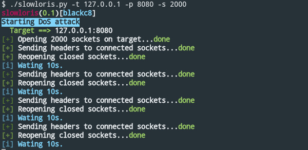
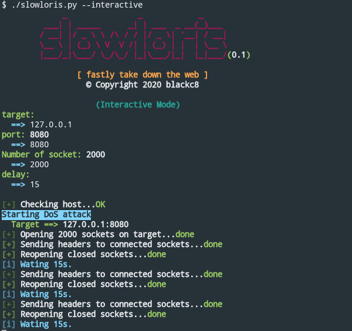

# slowloris
fastly take down the web
## What is it?
This tool is a DoS attacking tool that uses the slowloris technique to take down a HTTP webserver by RSnake.
The tools firstly creates a number of socket, then send an intial packets to make the server aware of the connection.After so it send small junks of data to the server to keep the connection alive.
This way it increase the server's no of acceptable connections and at a certain point the server could not accept more connection from any client and the server goes down.

## Getting Started
These instructions will get you a copy of the project up and running on your local machine for development and testing purposes

### Prerequisites 
What things you need to install the software and how to install them
```
python3
```

### 1.Clone the repository
```
git clone https://github.com/blackc8/slowloris.git
cd slowloris
```
### 2.Run a test
#### Start a Simple HTTP server
```
python -m http.server 8080
```
#### Now take down the web server

```
./slowloris.py -t 127.0.0.1 -p 8080 -s 1000
```

### 3.Use interactive mode
```
./slowloris --interactive
```

## Usage
```
usage: slowloris.py [-h] [-t TARGET] [-p PORT] [-s SOCKETS] [-d DELAY] [-i]

Fastly down the web

optional arguments:
  -h, --help            show this help message and exit
  -t TARGET, --target TARGET
                        hostname/IP of target
  -p PORT, --port PORT  specficy port to attack, default=80
  -s SOCKETS, --sockets SOCKETS
                        specify number of sockets to open, deafult=300
  -d DELAY, --delay DELAY
                        specify delay between packet sending, default=10
  -i, --interactive     launch the interactive mode
```

## Screenshots



## Contributers
*  **Initial work** - [blackc8](https://github.com/blackc8)
 
##  License & copyright
© 2020 blackc8

Licensed under the [MIT LICENSE](LICENSE)
